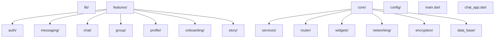
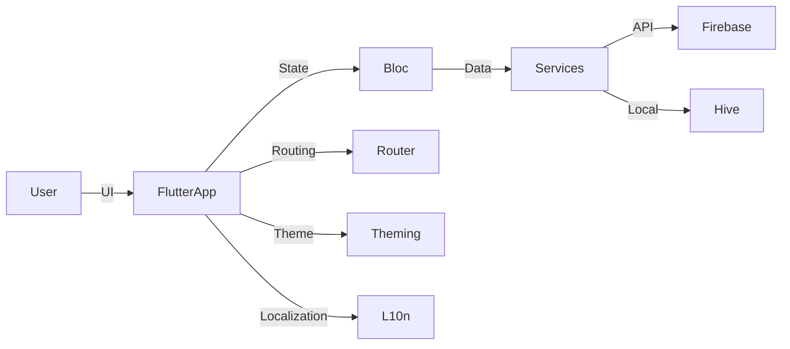
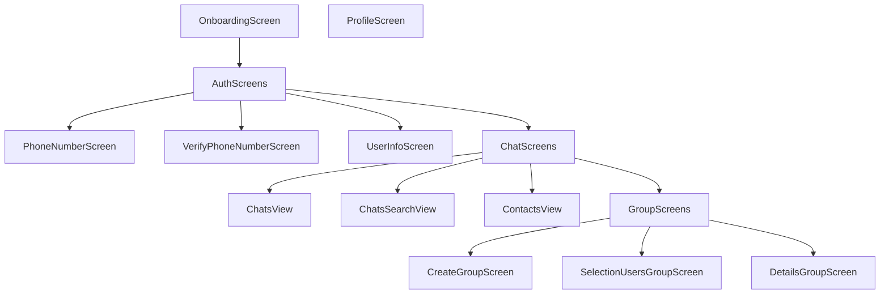

# 

# Telefay Chat System

---

## Overview
> Telefay is a modern, secure, and feature-rich chat application designed for seamless real-time communication. Built with Flutter, it supports group and individual messaging, media sharing, and robust authentication. The app is optimized for performance and user experience across platforms.

---

## Description
- Telefay enables users to connect, chat, and share media in real time.
- It offers secure authentication, group management, and a beautiful, responsive UI.
- Designed for scalability, reliability, and ease of use on both Android and iOS.

---

## App Logo

  

---

## What Does This App Do? (Step by Step)
1. **User Onboarding:** New users register and verify their phone number.
2. **Profile Setup:** Users set up their profile with a name and image.
3. **Authentication:** Secure login and session management.
4. **Chat:** Start individual or group chats, send messages, images, and files.
5. **Group Management:** Create, join, or manage groups with admin controls.
6. **Notifications:** Receive real-time push notifications for new messages.
7. **Settings:** Customize preferences and manage account security.

---

## Key Features
- 🔒 Secure Authentication (Phone number verification)
- 💬 Real-time Messaging (Individual & Group)
- 📎 Media & File Sharing
- 🛡️ Group Admin Controls
- 🌐 Multi-language Support
- 📱 Responsive UI for all devices
- 🔔 Push Notifications
- 🕵️‍♂️ End-to-End Encryption

---

## Core Technical Features
- Firebase Authentication & Messaging
- Bloc State Management
- Hive Local Database
- Sentry Error Tracking
- Custom Theming & Responsive Design
- Modular Architecture

---

## Development Skills Applied
- Flutter & Dart best practices
- Clean Architecture & Modularization
- State Management (Bloc)
- Asynchronous Programming
- UI/UX Design & Theming
- RESTful Networking
- Local & Cloud Data Storage

---

## Mobile Development
- Cross-platform (Android & iOS)
- Adaptive layouts with `flutter_screenutil`
- Native splash screens
- Platform-specific integrations (Firebase, Notifications)

---

## Tools & Methodologies
- **Version Control:** Git
- **CI/CD:** GitHub Actions
- **Testing:** flutter_test, flutter_lints
- **Error Tracking:** Sentry
- **Localization:** flutter_gen, intl
- **Performance:** Flutter DevTools

---

## Technology Stack
| Layer         | Technology/Package                |
|--------------|-----------------------------------|
| UI           | Flutter, flutter_screenutil        |
| State Mgmt   | flutter_bloc                      |
| Backend      | Firebase (Auth, Messaging)        |
| Local DB     | Hive                              |
| Networking   | http                              |
| Media        | image_picker, cached_network_image |
| Notifications| firebase_messaging                |
| Analytics    | Sentry                            |
| Localization | intl, flutter_gen                 |

---

## Application Structure

---

## Technical Architecture

---

## Screen Architecture

---

## Packages & Tools Used
- **State Management:** flutter_bloc
- **UI:** flutter_screenutil, progress_indicators
- **Media:** image_picker, cached_network_image, emoji_picker_flutter
- **Networking:** http, any_link_preview
- **Localization:** intl, flutter_gen
- **Notifications:** firebase_messaging
- **Testing:** flutter_test, flutter_lints
- **Other:** url_launcher, flutter_linkify, timeago

---

## Contact & Contribution
For questions, contributions, or issues, please open an issue or pull request on the repository.

---

<b>Made with ❤️ using Flutter</b>
 