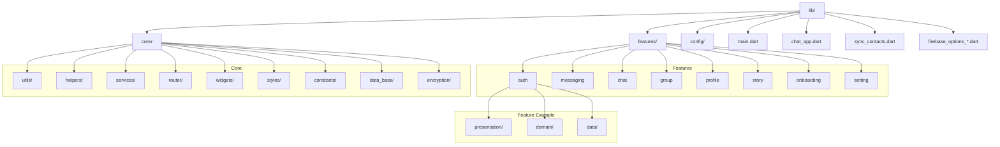
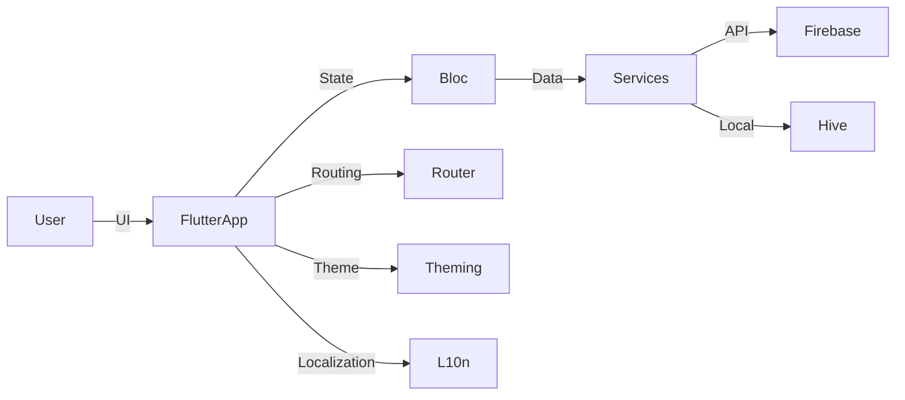
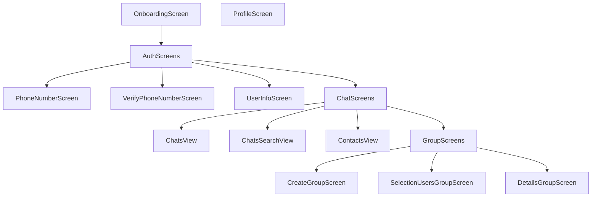

# Telefay Chat Application

---

## 📝 Overview
Telefay is a modern, secure, and feature-rich chat application designed for seamless real-time communication. Built with Flutter, it offers a beautiful, responsive UI and robust backend integration. The app supports individual and group messaging, media sharing, and advanced notification features.

---

## 📋 Description (3 lines)
Telefay is a secure, modern chat app for real-time communication. It supports group and individual messaging, media sharing, and notifications. Designed with a beautiful, responsive UI and robust architecture.

---

## 🪧 What Does This App Do? (Step-by-Step)
1. **User Registration:** Sign up with phone number and verify via OTP.
2. **Profile Setup:** Enter user details and sync contacts.
3. **Start Chatting:** Send messages, images, videos, and voice notes in real time.
4. **Group Chats:** Create and manage groups, add/remove users, assign admins.
5. **Stories:** Share and view stories with contacts.
6. **Notifications:** Receive instant push and local notifications for new messages.
7. **Settings:** Manage profile, app preferences, and notification settings.

---

## ✨ Key Features
- 🔒 Secure Authentication (Phone number verification)
- 💬 Real-time Messaging (Individual & Group)
- 📎 Media & File Sharing
- 🛡️ Group Admin Controls
- 🌐 Multi-language Support
- 📱 Responsive UI for all devices
- 🔔 Push Notifications
- 🕵️‍♂️ End-to-End Encryption

---

## 🚀 Core Technical Features
- Firebase Authentication & Messaging
- Bloc State Management
- Hive Local Database
- Sentry Error Tracking
- Custom Theming & Responsive Design
- Modular Architecture

---

## 🛠️ Development Skills Applied
- Flutter & Dart best practices
- Clean Architecture & Modularization
- State Management (Bloc)
- Asynchronous Programming
- UI/UX Design & Theming
- RESTful Networking
- Local & Cloud Data Storage

---

## 📱 Mobile Development
- Cross-platform (Android & iOS)
- Adaptive layouts with `flutter_screenutil`
- Native splash screens
- Platform-specific integrations (Firebase, Notifications)

---

## 🧰 Tools & Methodologies
- **Version Control:** Git
- **CI/CD:** GitHub Actions
- **Testing:** flutter_test, flutter_lints
- **Error Tracking:** Sentry
- **Localization:** flutter_gen, intl
- **Performance:** Flutter DevTools

---

## 🏗️ Technology Stack
| Layer                | Technology/Package                |
|----------------------|-----------------------------------|
| UI                   | Flutter, chat_ui, flutter_svg     |
| State Management     | flutter_bloc                      |
| Networking           | dio, pretty_dio_logger            |
| Real-Time Messaging  | socket_io_client                  |
| Local Storage        | hive, hive_flutter, flutter_secure_storage |
| Notifications        | firebase_messaging, flutter_local_notifications |
| Media                | image_picker, video_player, cached_network_image |
| Dependency Injection | get_it                            |
| Utilities            | intl, uuid, path_provider, dartz  |
| Animations           | animations, circular_clip_route   |
| Permissions          | permission_handler                |
| Others               | awesome_snackbar_content, pull_to_refresh, flip_card |

---

## 📦 Packages Used
<details>
<summary>Click to expand</summary>

- flutter_bloc
- dio, pretty_dio_logger
- socket_io_client
- hive, hive_flutter
- flutter_secure_storage
- firebase_core, firebase_messaging
- image_picker, video_player
- cached_network_image
- get_it
- dartz
- intl, intl_phone_field, country_codes
- permission_handler
- flutter_local_notifications
- animations, circular_clip_route
- path_provider, path
- awesome_snackbar_content
- pull_to_refresh
- flip_card
- after_layout
- voice_message_package
- gap
- equatable
- collection
- fast_contacts
- fluttertoast
- flutter_native_splash
- encrypt
- path_drawing
- flutter_svg
</details>

---
## 🏃‍♂️ How to Run & Develop
### Run with Flavors
- **Development:**
  ```
  flutter run --target lib/main_dev.dart --flavor dev
  ```
- **Production:**
  ```
  flutter run --target lib/main_prod.dart --flavor prod
  ```
- **Profile mode:**
  ```
  flutter run --profile --target lib/main_dev.dart --flavor dev
  ```

### Generate Hive Models
```
flutter packages pub run build_runner build --delete-conflicting-outputs
```

### Generate Localizations
```
flutter gen-l10n
```

### Create Launcher Icons
```
flutter pub run flutter_launcher_icons
```

### Custom Notification Sound (Android)
- Create folder:
  ```
  mkdir -p android/app/src/main/res/raw
  ```
- Add your sound file (e.g., `notification_sound.wav`) to the `raw` folder.
- For flavors:
  ```
  mkdir -p android/app/src/<your_flavor_name>/res/raw
  ```

### Change Android Notification Channel
- Default channel: Edit `android/app/src/main/res/values/strings.xml`
- Custom channel: Edit `lib/core/services/notifications/android_notification_channel.dart`
--- 

## 🖼️ Application Structure



---

## 🏛️ Technical Architecture



---

## 🖥️ Screen Architecture



---

<p align="center"><b>Made with ❤️ using Flutter</b></p> 
